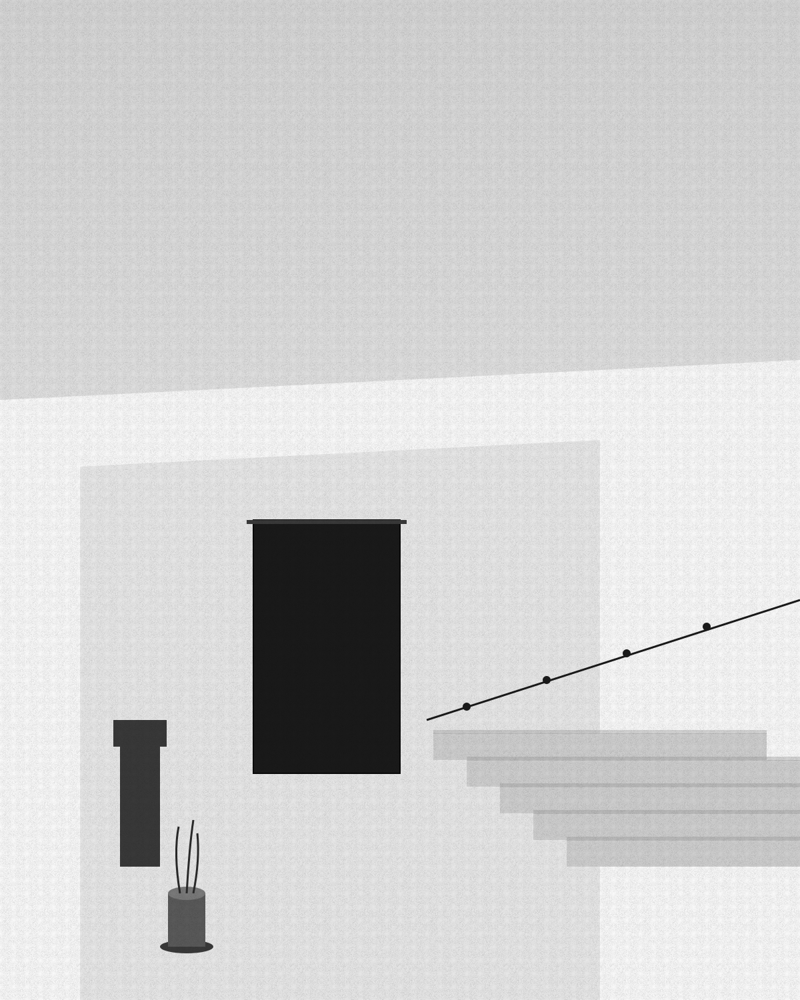

# Recto — Photography Portfolio HTML Template

A five-page editorial HTML template for photographers and visual artists. Pure white-on-white minimalism. Type-driven hierarchy. Photography is the only color on the page. Vanilla HTML/CSS/JS — no framework, no build step.

## Pages

| File | Purpose |
|---|---|
| `index.html` | Type-only poster hero, current series feature (full-bleed photo), latest 6 series strip, statement, journal teaser, press, CTA |
| `work.html` | Series catalog — 12 numbered/dated entries with cover hover preview, plus a 12-tile cover grid |
| `series.html` | Single series essay — alternating full-bleed plates, paired plates, captioned tall plate, prev/next pagination, prints CTA |
| `journal.html` | Notes between series — 9 short writings with archive metadata |
| `contact.html` | Five labeled contact blocks + 6-field inquiry form |

## Quick start

Open `index.html` in any browser. There is no build step.

## Design tokens

All design tokens live in CSS custom properties at the top of `assets/css/styles.css`:

```css
:root {
  --paper:      #ffffff;
  --ink:        #0a0a0a;
  --ink-soft:   #4a4a4a;
  --ink-mute:   #8a8a8a;

  --display: 'Newsreader', serif;
  --sans:    'Inter Tight', sans-serif;
  --mono:    'IBM Plex Mono', monospace;
}
```

There is no accent color — photography brings the color. Edit those values and the entire theme re-skins.

## Replace images

All visuals under `assets/img/` are labeled SVG placeholders that look intentional out of the box. Each `` is preceded by a comment with recommended dimensions:

```html
<!-- REPLACE: plate 01, the wall · 1920×1080 · WebP/JPG -->

```

| File | Where | Recommended |
|---|---|---|
| `series-01.svg` … `series-12.svg` | Series covers + essay plates | 1200×1500 portrait or 1920×1200 landscape |
| `portrait.svg` | About page portrait | 800×1000 portrait |

## Tech

- Vanilla HTML, CSS, vanilla JS (no framework, no build)
- Google Fonts: Newsreader, Inter Tight, IBM Plex Mono — preconnected
- Responsive: 320 / 480 / 768 / 1024 / 1440+
- Accessible: semantic landmarks, keyboard-visible focus, alt text on every image
- Reduced-motion respect

## License

Free for personal and commercial use. See html.design license page for details.
